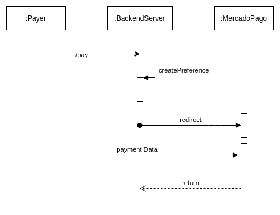

# Spring Boot with MercadoPago
Simple web application with Spring Boot using *redirect* aproach


## Requirements
1. MercadoPago account
2. Application created at MercadoPago console
3. Access Token (from Credentials)

## Usage
1. Run the server
```bash
MP_ACCESS_TOKEN=[PASTE_YOUR_ACCESS_TOKEN_HERE] ./gradlew bootRun
```
2. Go to
```bash
http://localhost:8080/createAndRedirect
``` 